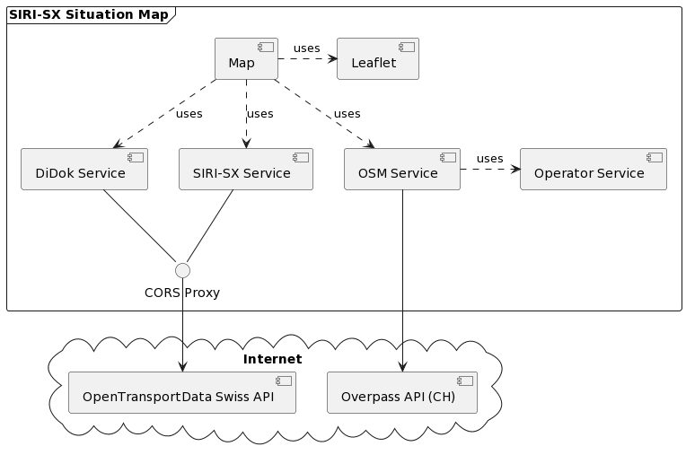
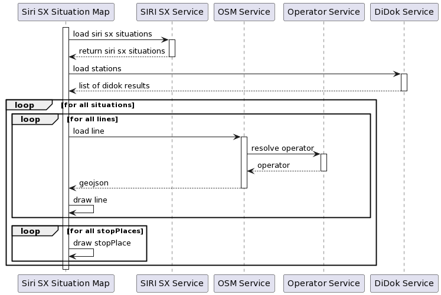
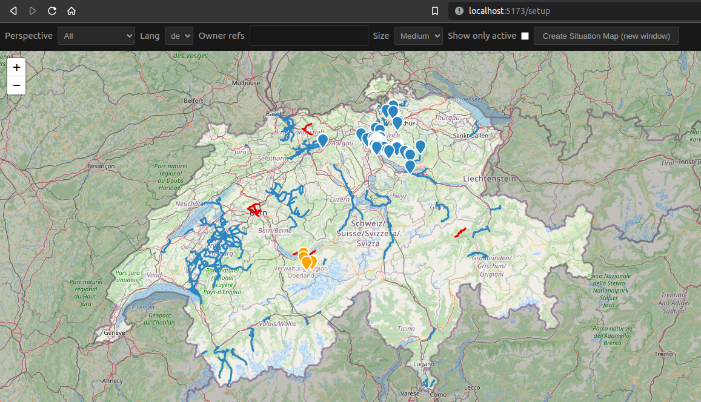

# SIRI SX Situation Map Doc

- [SIRI SX Situation Map Doc](#siri-sx-situation-map-doc)
    * [Initial Situation & Goal](#initial-situation-goal)
    * [Technologies & Architecture](#technologies-architecture)
        + [Application Structure](#application-structure)
    * [Backlog & Problems](#backlog-problems)
        + [Performance](#performance)
        + [Areas for improvement](#areas-for-improvement)
    * [Development](#development)
        + [Environment](#environment)
        + [How to run](#how-to-run)
    * [How To Deploy](#how-to-deploy)
    * [How To Use Embedded Map](#how-to-use-embedded-map)
        + [Query parameters](#query-parameters)
        + [URL configurator](#url-configurator)
        + [Map Embedding](#map-embedding)

## Initial Situation & Goal

The SBB starts to publish disruption messages as SIRI SX
messages ([XML](https://www.google.com/url?sa=t&rct=j&q=&esrc=s&source=web&cd=&cad=rja&uact=8&ved=2ahUKEwj59YT60pD2AhWLhv0HHXnzDy4QFnoECBAQAQ&url=https://www.vdv.de/736-2-sds.pdfx&usg=AOvVaw2h5n4Vftl94idzP4b920nF))
request/response.
These messages can be requested and visualized.
The [interface](https://transportdatamanagement.ch/content/uploads/2020/11/Architektur_Ereignisdatenaustausch.pdf) is
still under construction. A first
visualization gives hints how and if it can be worked with.\

The project would be a first step in this direction and would include the following:

- Development of a webapp which can request disruption messages and can evaluate the response.
- The disruption are displayed on a map and can be filtered.

> The Idea of this project is to create a website similar
> to [SIRI SX Situation Monitor](https://github.com/openTdataCH/siri-sx-situation-monitor)
> and instead of showing the disruption messages in a list, we visualize the data on a map.

## Technologies & Architecture

Because we didn't have to build a huge single page application we wanted to use a framework that has flexibility and has a smaller footprint in contrast to something like angular.
We didn't want to write much boilerplate code, because it's time-consuming, therefore, we decided to use Vue with typescript

<div>
    <a href="https://www.typescriptlang.org/"></a>
    <a href="https://vuejs.org/"></a>
    <a href="https://vitejs.dev/"></a>
    <a href="https://leafletjs.com/"></a>
    <a href="https://www.openstreetmap.org/"></a>
</div>

To visualize the disruption messages we used the library Leaflet, because it is fast, reliabel and one of the best known map library out there.
We obtain our map data from OpenStreetMap because it's free, and it has lots of data

### Application Structure

Our Application has a simple structure, and is designed to be easily extensible.
For a quick understanding ouf our application structure, these two diagrams below should help out.

#### Component Diagram



#### Sequence Diagram

The most complicated piece of code is in the map component,
and it is responsible to collect the data from the different services and then pass on the data to the displaying components.
For easier understanding we create this sequence diagram.



## Backlog & Problems

### Performance

During the development of the application the performance was not our primary focus/goal,
right now the application isn't optimized and there are many places where the performance can or should be improved.

#### OSM Line loading

The Line information from OSM is requested with a query for each line we have to display.\
A simple improvement is to collect these queries to one big query and only ask osm once for all lines in one request.

### Areas for improvement

#### Map Component Refactoring

Right now the map component is our most complex piece of code and is in a need of a refactoring.
We created a sequence diagramm to help understand what the component does.

#### XML Schema Definition

We didn't get a XSD for the SIRI-SX api, this is why we parsed the data with plain js.
We suggest to ask for a XSD or create one yourself, so the parsing can be removed and the code can be simplified.

## Development

For local development you need to install npm. See the
following [link](https://docs.npmjs.com/downloading-and-installing-node-js-and-npm#using-a-node-version-manager-to-install-nodejs-and-npm)
for how to install npm.

After npm is installed you can then download the dependencies needed by the application.

```shell
npm install
```

### Environment

You need to create a `.env.local` file with the following environment variable:

```properties
ODP_TOKEN=<your odp prod token>
```

### How to run

you can run the app locally with the following command.

``` shell
npm run dev
```

The command above starts a [vite](https://vitejs.dev/) server and the application is automatically refreshed when you
make some changes.

## How to Deploy

We created a Docker file which start a server serving the application and proxying the api requests.
Make sure you've set-up the local `.env.local` file as mentioned above.

Build the docker image with the following command:

```shell
docker build -t siri-sx-situation-map .
```

You can then push the built image to Docker Hub or any other registry of your choice.

To start the image locally you can run the following command:

```shell
docker run -p 8080:8080 --rm --name siri-sx-situation-map --env-file .env.local siri-sx-situation-map
```

**Important**: Make sure you've set-up the local `.env.local` file as mentioned above.

## How to Use Embedded Map

This Section describes how to configure the situation map and how to embed the map to any website.

### Query parameters

All parameters are optional and the default value are used.

| Param       | Values                                        | Default    | Description                                                                                                                                              |
|-------------|-----------------------------------------------|------------|----------------------------------------------------------------------------------------------------------------------------------------------------------|
| lang        | `DE`, `EN`, `FR`, `IT`                        | `DE`       | Language used for disturbance information                                                                                                                |
| size        | `M`, `L`, `S`                                 | `M`        | The size of the disturbance information                                                                                                                  |
| ownerRefs   | String                                        |            | Comma separated strings of the OwnerRef, i.e. 100602 for PostAuto. Full list: [Business Organisations](https://opentransportdata.swiss/en/dataset/goch). |
| perspective | ` `, `general`, `stopPoint`, `vehicleJourney` | ` `        | Perspective of the disturbance information. Default are shown all perspectives.                                                                          |
| zoom        | Number                                        | 8          | The Zoom level of the map                                                                                                                                |
| center      | String                                        | `46.8,8.2` | The center position of the map as comma seperated `lat`,`lng`                                                                                            |
| active      | `1`                                           |            | Show only active situation                                                                                                                               |

### URL configurator

The parameters above are configurable via the `/setup` url.



- the perspective can be changed with the dropdown on the top left.
- the language can be changed with the language dropdown on the top second from left.
- In the "Owner refs" Input you can add as much owner id's as you like and also remove them.
- With the Size dropdown you can specify the size of the text wich should be displayed for the situations.
- When the "Show only active" checkbox is activated, the map only shows active situations
- you can move the map and zoom as you'd like and the Iframe will always show the map exactly as you see it.
- The "Create Situation Map (new window)" Button, will open a new window with the specified filter and map section. The
  link in the url can then be used for an IFrame.

### Map Embedding

The URL can be then embedded in an HTML IFrame as in the following example:

```html

<iframe
        width="100%" height="500"
        src="http://localhost:5173"></iframe>
```